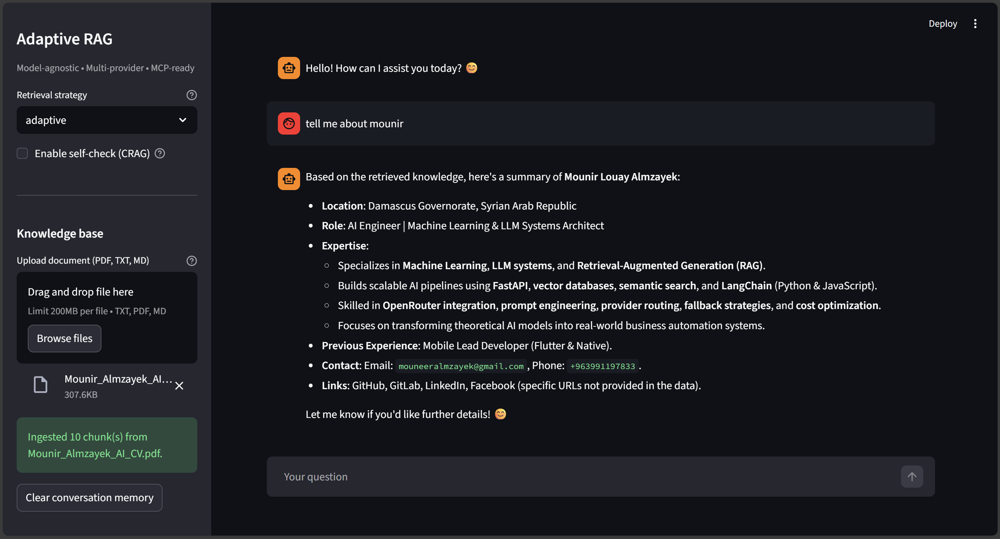

# Adaptive Agentic RAG System

**Modular • Multi-Provider • MCP-Ready • Production Architecture**

A production-ready, model-agnostic RAG (Retrieval-Augmented Generation) system with adaptive retrieval, conversation memory, tool orchestration, and MCP compatibility. Built for scalability and portfolio/SaaS readiness.

### Screenshot



---

## Documentation (Planning Phase)

| Document | Purpose |
|----------|---------|
| [PROJECT_OVERVIEW.md](docs/PROJECT_OVERVIEW.md) | Vision, goals, scope, success criteria |
| [ARCHITECTURE.md](docs/ARCHITECTURE.md) | System design, components, data flow |
| [TECH_STACK.md](docs/TECH_STACK.md) | OpenRouter, LangChain, and dependencies |
| [PHASES.md](docs/PHASES.md) | Master implementation roadmap |
| [PHASE_01_FOUNDATION.md](docs/phases/PHASE_01_FOUNDATION.md) | Config, structure, model factory |
| [PHASE_02_RAG_CORE.md](docs/phases/PHASE_02_RAG_CORE.md) | Retrieval engine, vector store, ingestion |
| [PHASE_03_AGENT_MEMORY.md](docs/phases/PHASE_03_AGENT_MEMORY.md) | Agent factory, memory, tool registry |
| [PHASE_04_SERVICE_LAYER.md](docs/phases/PHASE_04_SERVICE_LAYER.md) | RAG service, self-reflection, CRAG |
| [PHASE_05_UI_MCP.md](docs/phases/PHASE_05_UI_MCP.md) | Streamlit app, MCP layer |
| [CONVENTIONS.md](docs/CONVENTIONS.md) | Code style, naming, patterns |
| [GLOSSARY.md](docs/GLOSSARY.md) | Terms and abbreviations |

---

## Target Structure (Post-Implementation)

```
adaptive_rag/
├── app/                 # Streamlit UI
├── core/                # Agent, model, tool factories
├── rag/                 # Retrieval, reranker, adaptive router
├── memory/              # Conversation memory
├── knowledge/           # Vector store, ingestion
├── services/            # RAG service, orchestration
├── config/              # Settings, env
├── mcp/                 # MCP server / tool exposure
└── docs/                # Planning and reference
```

---

## Status

**Phase 1 (Foundation)** — Done. Config, model factory (OpenRouter + LangChain), tests.  
**Phase 2 (RAG Core)** — Done. Vector store (Chroma), ingestion (PDF/txt/md), retrieval engine (vector/hybrid/adaptive), adaptive router, optional reranker.  
**Phase 3 (Agent & Memory)** — Done. ConversationMemory, ToolRegistry (calculator, search_knowledge stub), create_agent (tool-calling loop with context + knowledge_docs).  
**Phase 4 (Service Layer)** — Done. RAGService.ask(), RAGResponse, self_check, CRAG-style corrective retry, build_rag_service (search_knowledge wired to retrieval).  
**Phase 5 (UI & MCP)** — Done. Streamlit chat + ingestion upload + clear memory; FastAPI /ask and /tool/search_knowledge with CORS.

### Run tests (from repo root)

```bash
# Unit tests (no API key required for provider/key validation tests)
PYTHONPATH=. python -m pytest tests/ -v -m unit

# Smoke test (requires OPENROUTER_API_KEY in .env)
PYTHONPATH=. python -m pytest tests/ -v -m smoke
# Or: PYTHONPATH=. python scripts/smoke_llm.py
```

Note: Chroma tests are skipped on Python 3.14 due to chromadb/pydantic compatibility; use Python 3.11–3.12 for full RAG tests.

**All phases complete.** See [docs/RUNNING.md](docs/RUNNING.md) to run the Streamlit UI and MCP API. For Docker: `docker compose up -d --build` (Streamlit on 8501, MCP on 8000).
